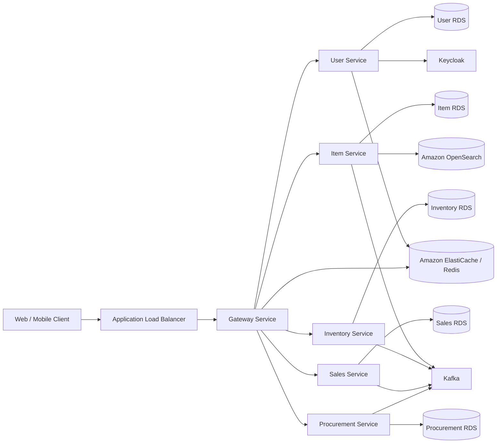

# BBD ERP

> **"본사, 지점, 현장이 같은 부품 데이터를 실시간으로 공유하는 MSA 기반 ERP 프로젝트"**

## 관련 링크

- **서비스 URL**: [https://console.inwoohub.com](https://console.inwoohub.com)
- **발표 자료**: `ERP 현대.pdf`

---

## 1. 프로젝트 소개

### 공통

- BBD ERP는 부품 유통 기업의 본사, 지점, 현장이 재고, 주문, 발주, 생산 데이터를 하나의 흐름으로 관리할 수 있도록 만든 ERP 시스템입니다.
- 수기 발주, 전화 확인, 엑셀 대장처럼 분산되어 있던 업무를 웹/모바일 기반 업무 시스템으로 통합하는 것을 목표로 했습니다.
- 3종 클라이언트와 6개 백엔드 마이크로서비스를 구성하고, 서비스별 데이터베이스를 분리해 도메인 책임을 명확히 했습니다.

### 주요 업무 흐름

- **CO(Customer Order)**: 지점이 고객 주문을 작성하고 지점에서 승인
- **STR/SO(Stock Transfer Request)**: 지점이 재고 이동을 요청하고 본사에서 승인
- **PO(Purchase Order)**: 본사가 공급사 발주를 작성하고 승인
- **WO(Work Order)**: 본사가 생산 요청을 작성하고 승인

<br/>

## 2. 프로젝트 아키텍처



### 서버 구성

- AWS ALB 아래 ECS Fargate 기반으로 Gateway, User, Item, Inventory, Sales, Procurement 서비스를 배포했습니다.
- 서비스별 RDS를 분리해 MSA 환경에서 도메인별 데이터 소유권을 명확히 했습니다.
- Kafka 기반 EDA를 적용해 서비스 간 결합도를 낮추고, 메시지 유실 방지를 위해 Transactional Outbox 패턴을 도입했습니다.
- Keycloak, Kafka 등 별도 운영이 필요한 구성요소는 EC2 환경에서 운용했습니다.
- OpenSearch로 품목 자동완성 검색을 개선하고, Redis/ElastiCache를 인증/인가 및 캐시 흐름에 활용했습니다.

<br/>

## 3. 개발 전략

### 협업 전략

- **Jira**: 작업 단위 관리, 진행 상황 문서화, 컨벤션 정의
- **Notion / Discord**: API 구현 상황 공유, 데일리 스크럼, 의사결정 기록
- **도메인 분리**: Inventory, Item, Sales, Procurement, User/Auth, Gateway로 책임 범위를 나누어 병렬 개발

### 아키텍처 전략

- **MSA**: 서비스별 책임과 DB를 분리해 장애 전파와 변경 범위를 줄였습니다.
- **EDA**: Kafka 이벤트 발행/구독으로 재고, 발주, 생산, 수주 흐름을 비동기로 연결했습니다.
- **Transactional Outbox**: 비즈니스 DB 변경과 이벤트 저장을 하나의 트랜잭션으로 묶어 메시지 유실 가능성을 줄였습니다.
- **권한 기반 접근 제어**: 본사/지점/관리자 권한을 기준으로 웹과 모바일 기능 범위를 분리했습니다.

<br/>

## 4. 채택한 개발 기술

### Backend / Infra

- **Backend**: Spring Boot, Spring Security, Spring Data JPA, Querydsl
- **Auth**: Keycloak, OIDC Authorization Code Flow + PKCE, Role 기반 인가
- **Messaging**: Kafka, Transactional Outbox
- **Search / Cache**: OpenSearch, Redis, Amazon ElastiCache
- **Database**: Amazon RDS, PostgreSQL
- **Infra**: AWS ECS Fargate, EC2, ALB, ECR, Docker
- **CI/CD**: GitHub Actions, Docker Hub, Amazon ECR, ECS Service Update
- **Test / Monitoring**: k6, AWS 모니터링 지표 기반 부하 테스트

<br/>

## 5. 서비스 구성

```text
BBD ERP
├── gateway              # 클라이언트 진입점, 인증/인가 흐름 연계
├── user                 # 사용자 계정, 권한, 세션 정책, 사용자 스냅샷
├── item                 # 품목 카탈로그, 품목 검색, 자동완성
├── inventory            # 창고 재고, 입고/출고/조정/예약, CQRS 기반 재고 도메인
├── sales                # 고객 주문, 수주, 재고 예약, 멱등성 처리
└── procurement          # 발주, 생산 요청, 공급사, 작업지시, 입고 완료 처리
```

<br/>

## 6. 역할 분담

| 김준성 | 황인우 | 이다영 | 임유리 | 최시원 |
| :---: | :---: | :---: | :---: | :---: |
| PM / Inventory | Infra / Item | Procurement | Sales | Gateway / Auth / User |
| 재고 도메인 설계, CQRS 구조, 재고 변경 이벤트 연동 | AWS 인프라, CI/CD, ECS 배포, Item 조회/검색 성능 개선 | 발주/생산/공급사 도메인, PO/WO 상태 흐름, 동시성 제어 | 수주/예약 도메인, oversell 방지, 멱등성/예약 만료 전략 | Keycloak 인증, OIDC 로그인/로그아웃, 권한/세션 정책, 보안 프레임워크 |

<br/>

## 7. 권한별 주요 기능

### 지점 웹

- 대시보드
- 재고 현황 조회
- 수주(CO) 작성 및 관리
- 재고 이동 요청(STR/SO)

### 본사 웹

- 영업/재고이동 대시보드
- 발주/생산 대시보드
- 재고 대시보드
- 품목 관리
- 입출고 내역 조회
- 발주(PO) 관리
- 안전재고 미달 품목 주문
- 공급사 관리
- 작업지시(WO) 관리

### 관리자 웹

- 시스템 사용자와 기준 정보 관리
- 본사/지점 권한 기반 업무 범위 관리

### 지점 모바일

- 대시보드
- 입고/출고 스캔
- 마이페이지

<br/>

## 8. 신경 쓴 부분

### 이벤트 기반 서비스 연동

- 동기 호출만 사용할 경우 한 서비스 장애가 다른 서비스로 전파될 수 있어 Kafka 기반 EDA를 적용했습니다.
- 재고 증가, 백오더, 발주/생산 완료 같은 도메인 이벤트를 발행하고, 각 서비스가 필요한 후속 처리를 수행하도록 구성했습니다.
- Transactional Outbox 패턴으로 DB 변경과 이벤트 저장을 함께 처리해 이벤트 유실 가능성을 낮췄습니다.

### 인프라와 가용성 검증

- GitHub Actions에서 Docker 이미지를 빌드하고 Docker Hub/ECR로 푸시한 뒤 ECS Fargate 서비스를 갱신하는 배포 흐름을 구성했습니다.
- k6 부하 테스트를 통해 오토스케일링 전후를 비교했고, 실패율을 **88.10% → 17.14%**로 줄였습니다.
- B2B 시스템 특성상 운영비보다 가용성 손실 비용이 크다고 판단해, 스케일 다운보다 안정적인 처리량 확보를 우선했습니다.

### Item 조회/검색 성능 개선

- 품목 카탈로그 조회는 가장 빈번한 조회라고 판단해 복합 인덱스와 쿼리 개선을 적용했습니다.
- 기존 JPA/LIKE 기반 자동완성 검색은 평균 약 **3.14초**가 소요되었고, OpenSearch 적용 후 평균 약 **0.036초**로 개선했습니다.
- 조회 목적에 따라 Native Query, Querydsl, OpenSearch를 비교하며 적합한 방식을 선택했습니다.

### 인증/인가와 세션 정책

- Keycloak 기반 OIDC Authorization Code Flow + PKCE로 웹/모바일 인증 흐름을 구성했습니다.
- 웹은 사용자별 1개 세션 정책, 모바일은 JWT의 `sub`, `sid`와 Redis를 활용한 기기 세션 검증 정책을 적용했습니다.
- `@RequireRole` 기반 보안 프레임워크를 구성해 서비스 메서드 실행 전 권한을 검사하도록 만들었습니다.

### 도메인 정합성과 동시성 제어

- Inventory는 읽기와 쓰기 책임이 다르다고 판단해 CQRS 구조로 분리했습니다.
- Procurement는 PO/WO 입고 완료 중복 처리에는 낙관적 락을, SO 부분 입고 수량 차감처럼 덮어쓰기 위험이 큰 구간에는 비관적 락을 적용했습니다.
- Sales는 재고의 단일 소유권을 Inventory가 갖도록 하고, 재고 예약 요청을 Inventory 동기 호출로 직렬화해 oversell을 방지했습니다.
- 멱등키, 예약 TTL, 이벤트 Dedup 전략으로 서비스 경계를 넘는 작업의 정합성을 보완했습니다.

<br/>

## 9. 목표 달성률

| 구분 | 완료 | 개선 후 완료 | 부분 완료 | 미완료 | 실질 충족률 |
| :--- | ---: | ---: | ---: | ---: | ---: |
| 기능 요구사항 | 83개 | 2개 | 6개 | 8개 | 85.90% |
| 비기능 요구사항 | 20개 | 1개 | 3개 | 8개 | 65.60% |

<br/>

## 10. 향후 개선 사항

- Kafka DLT(Dead Letter Topic)를 도입해 실패 이벤트를 분리하고, 원인 분석/재시도/수동 복구 절차를 고도화
- 스케줄러 기반 Outbox Relay를 Debezium CDC 기반 구조로 개선해 이벤트 발행 지연 감소
- 본사 주도의 지점 간 재고 이동 프로세스 정립
- CO 수주 확정 전 재고 선확보 흐름 최적화
- 공급사와 판매 품목 간 매핑 구조 개선
- 안전재고 미달 품목 대상 자동 발주 로직 구축

<br/>

## 11. 프로젝트 후기

<details>
<summary>김준성</summary>

MSA ERP 시스템을 실무적인 주제로 좋은 팀원들과 개발할 수 있어서 유익하고 뜻깊은 시간이었습니다.

</details>

<details>
<summary>황인우</summary>

소외되는 사람 없이 모두가 열심히 하는 팀으로 함께해서 즐거웠습니다.

</details>

<details>
<summary>최시원</summary>

MSA 시스템을 구현하면서 각 서비스 간의 책임과 역할 분리에 대해서 고민해보는 유익한 시간이었습니다.

</details>

<details>
<summary>임유리</summary>

MSA와 ERP처럼 처음 접하는 시스템을 구현하며 서비스 간 경계와 책임을 기준으로 사고하는 경험을 할 수 있었습니다. 또한 하나의 서비스를 온전히 책임지며 협업해볼 수 있어서 큰 성장의 기회가 되었습니다.

</details>

<details>
<summary>이다영</summary>

맡은 분야에 최선을 다하는 팀원들과 대규모 프로젝트를 경험하며 개인적 개발 역량을 키우는 동시에 앞으로의 팀 프로젝트에 임하는 자세를 정립할 수 있었던 성장의 시간이었습니다.

</details>
